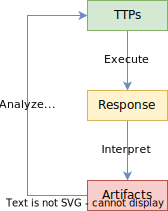

# Research

Introducing an adversarial mindset to an organization's security assurance

A [penetration test](https://www.eccouncil.org/cybersecurity/what-is-penetration-testing/) is a simulated attack
used to identify organizational vulnerabilities and inform cyber security policy.

Red teaming goes a step beyond a penetration test. A [red team](https://www.crowdstrike.com/cybersecurity-101/red-teaming/)
engagement uses ethical hacking to emulate an adversary attempting to breach an organization's security posture.

A lack of observability within a red team engagement often leads to trickle-down miscommunication.

Unfortunately, attack data presentation is often not considered for the workflow of How attackers view and use data
to accomplish objectives (critical thinking)

## Main Idea

A lack of observability within penetration tests often leads to
trickle-down miscommunication.

## Red Team Lifecycle

Knowledge often gets lost in translation within a red team
during an engagement and from the  red team to the blue team
when describing TTPs used.

### Strengths of Models

- Effectively reduce misunderstanding and miscommunications.
- Understand attacker motivations and patterns to better prioritize defenses, allocate
resources, inform policies, and develop incident response plans.

### Weaknesses of Models

- Simplified representations of complex systems are subject to loss of detail.
- Disciplinary assumptions, limited scope, and finite predictive ability.

### Well-Known Models

[Unified Kill Chain](https://www.unifiedkillchain.com/)

:   Kill chains outline the phased progressions of an attacker toward their goals:
    in, through, and out.

[ATT&CK Framework](https://attack.mitre.org/)

:   Matrixes categorize TTPs from each phase and map them to general threat objectives.

[Diamond Model](https://www.activeresponse.org/wp-content/uploads/2013/07/diamond.pdf)

:   Identifying the relationships within an intrusion to better understand attacker motivations;
    an adversary deploys a capability over some infrastructure against a victim.

### Adversarial Decision Making

The adversarial decision making model (ADMM) is a feedback loop that models the atomic thought process
of a hacker. There is nothing special about the ADMM, as it is similar
to other decision making models such as the
[OODA Loop](https://www.oodaloop.com/the-ooda-loop-explained-the-real-story-about-the-ultimate-model-for-decision-making-in-competitive-environments/).
The ADMM was designed to highlight the points of friction that a hacker would encounter during an interactive engagement.
Other industry models emphasize post analysis focused on the blue team whereas the ADMM considers the engagement workflow that ultimately
led to the post analysis story.

**ADDM**

Each block in the diagram has a protruding arrow is a point of friction within a penetration test
engagement. If you were to consider a cyber kill chain, this ADMM process would be a sub loop within each phase.

- TTPs
- Response
- Artifacts

• Like the OODA Loop
Description
• Represents the adversarial mindset during a penetration test, NOT post-analysis.
• Occurs within each cyber kill chain phase as a feedback loop.
• Each block to protruding arrow is a point of friction within a penetration test
engagement.
Plot
• Miscommunication leads to red team inefficiency and/or ineffective customer
reporting.
• Penetration testing management solutions (artifacts) are not effective because
attack data is not made presentable by response interpretation

## Background

## Problem Statement

Complete lexical analysis of interactive shell data would empower
contextual post-processing resulting in effective presentation of
attack data.

Problem Statement
• Interactive shell data is atomic and semantic analysis from this data drives penetration testing
management systems. Red teams struggle with communication and documentation because
computer hacking is weird, and the systems available are too rigid to present attack data.
• The lexical analysis of shell data would empower the post-processing of attack data to create robust
presentation systems. Solution ubiquity is necessary because there are N number of information
security tools and controlling a tool pipeline raises operational security concerns.
• Unfortunately, terminal recorders do not distinguish a parent shell from a child shell, the subshell
problem.
Solution Statement
• Pasta is a ubiquitous shell processing utility for improving penetration test observability via lexical
analysis of terminal emulation. The tool will serve as a drop-in local shell replacement and the library
will aid future semantic analysis.